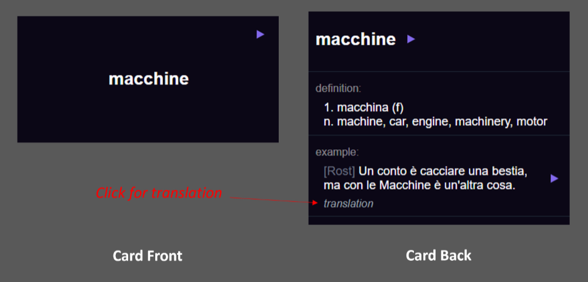
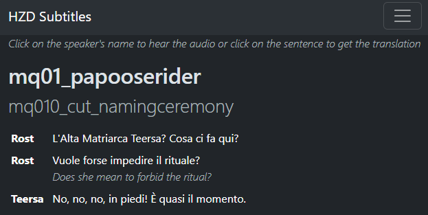
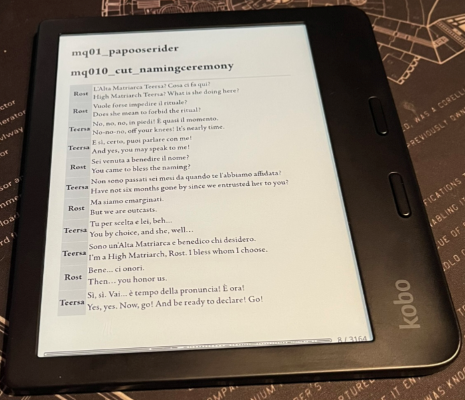
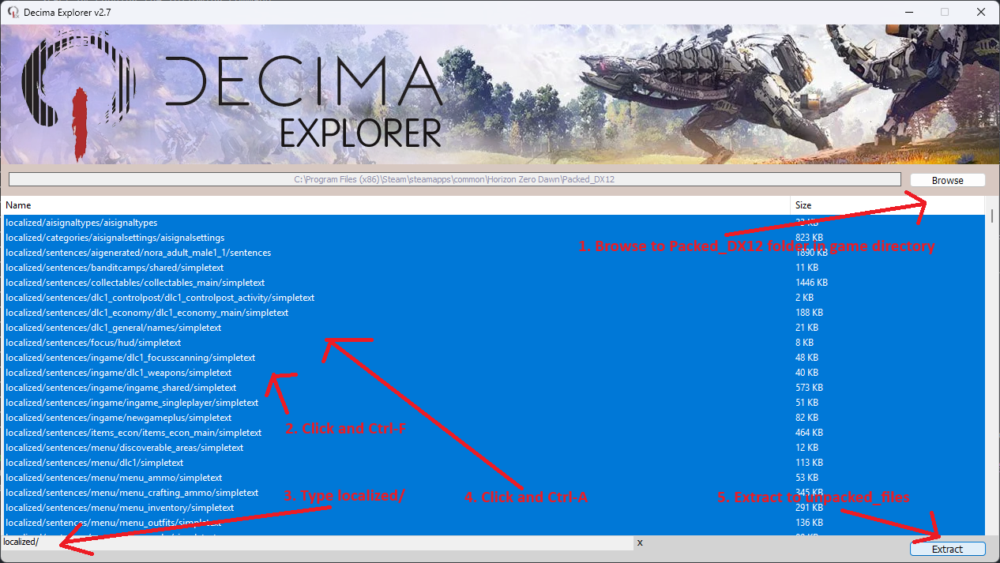

# Description

This script extracts the subtitles and audio from the PC version of Horizon: Zero Dawn, creates an interactive transcript of every conversation and creates an [Anki](https://apps.ankiweb.net/) deck. The Anki deck consists of the most common words in the game that are less common in the general language (e.g. "Machine", "Hunting" and "Seeker" are in the Anki Deck but not "Hello").

Spreadsheets of each line in the game and a frequency analysis of the words are also generated.

In theory, some light modification of the scripts should allow this to work with [other Decima engine games](<https://en.wikipedia.org/wiki/Decima_(game_engine)>) (such as Death Stranding) but I haven't done any development or testing with it.

It should work with language that the game supports but has only been tested with Italian as the target language and English as the native language. Other romance languages should work fine but more distant languages (such as Chinese or Arabic) might need to have the subtitle filters tweaked for optimal output. If you do this, please raise a pull request with the changes and I'll merge it in to this repository. According to [pydecima](https://pypi.org/project/pydecima/), the supported languages for Horizon are English, French, Spanish, German, Italian, Dutch, Portuguese, TraditionalChinese, Korean, Russian, Polish, Danish, Finnish, Norwegian, Swedish, Japanese, LatinAmericanSpanish, BrazilianPortuguese, Turkish, Arabic and SimplifiedChinese. [Some languages only have subtitle support but others have audio too](https://www.pcgamingwiki.com/wiki/Horizon_Zero_Dawn#Localizations).

Please feel free to use the python modules and html templates in your own projects. Please link back to this page if you do, in line with the [licence](LICENSE.txt). I'd also love to see anything that you make! You can add a link to it, or any problems that you have using the script to [here](https://github.com/jonathanfox5/translate_horizon_zero_dawn/issues).

Screenshot of the Anki Cards:



Interactive transcript (you can click the speaker's name to hear the line or click the target language text to get the translation):



The transcript can also be loaded onto an eReader, with or without translations:



# Youtube Tutorial

Youtube tutorial for getting it working. Alternatively, see the text instructions further down this readme.

[](https://www.youtube.com/watch?v=YOUTUBE_VIDEO_ID_HERE)

# Installation Steps

## Pre-Installation

You will need the Steam version of Horizon: Zero Dawn installed. For other versions and other Decima games, you may have to make some changes to the settings files (e.g. if you use the GOG version) or the code (e.g. if you are trying to make this work with a different Decima engine game).

You need Python and FFMPEG installed in order to use this set of scripts. Python is the scripting language and FFMPEG (optional) is used to convert the audio lines from the game into a format that your web browser and Anki can play back.

1. Install [Python](https://www.python.org/ftp/python/3.12.7/python-3.12.7-amd64.exe) and make sure you add it to path in the installer. See [this image](reference/readme_images/python_path.png) for reference on adding it to path.
2. _(Optional)_ For audio support, install [FFMPEG](https://www.gyan.dev/ffmpeg/builds/ffmpeg-release-full.7z) and make sure it is in your path. [Tutorial link](https://windowsloop.com/install-ffmpeg-windows-10/).

## Installing the Python Modules

1. Download [this repository](https://github.com/jonathanfox5/translate_horizon_zero_dawn/archive/refs/heads/main.zip) and extract the zip anywhere you like. It includes this readme file and all of the scripts and other resources to make it work.
2. Open a terminal window in the folder where this readme file is. The easiest way of doing this is typing `cmd` in the address bar at the top and hitting enter. [Other options for getting a terminal, depending on your version of Windows](https://www.howtogeek.com/789662/how-to-open-a-cmd-window-in-a-folder-on-windows/).
3. Type the following command and press enter to install the modules. (If you know what a venv is, you should do that first. Otherwise, just go straight to this command!)

```bash
pip install -r requirements.txt
```

## Update Settings

We need to update the settings so that the script knows the languages that you want to use and where your files are.

Start by running the following command:

```bash
python 00_Update_Settings.py
```

Update the following settings and then save and close the file once you have made them:

1. `GAME_ROOT` should be the installation directory of Horizon. You can find this easily by clicking on "manage local files" in Steam ([screenshot for reference](reference/readme_images/game_root.png)). Please keep the quotes and the `r` at the start, they are needed for the script to work properly on Windows.
2. `NATIVE_LANG` and `TARGET_LANG` should be set to your requirements. The 6th line of the settings file states the way that each language should be written for it to be recognised by the script. Please keep `ETextLanguages.` on front of your language name and the capitalisation as per the 6th line, otherwise it won't work.
3. `INCLUDE_AUDIO` can be set to `True` or `False` (with the first letter capitalised and the remaining letters lower case). Setting this to `False` means that scripts will run without FFMPEG installed and the "build transcript" script will run significantly quicker (less than 30 seconds vs 1hour+). `True` is required for audio to work in Anki and in the interactive transcript.

The following settings only need to be set if you are planning on running the script to create the anki deck. If you aren't, feel free to ignore them!

1. `ANKI_MAX_CARDS` is the size of the Anki deck. I don't recommend that you go above 1000, otherwise it can take quite long to run the script.
2. `DICTIONARY_PATH` is the path of the dictionary file in json format from which the definition will be looked up. The [Vocabsieve Manual](https://docs.freelanguagetools.org/resources.html) is a good starting point for json dictionaries. I like the Vicon dictionary for Italian as it automatically lemmatises the words. Wikitionary is a good choice too.
3. `WORD_AUDIO_PATH` is the path where the mp3 audio is for each individual word. The [Vocabsieve Manual](https://docs.freelanguagetools.org/resources.html) is a good starting point for word mp3 files. I use both the Forvo and the Lingua Libre files in Italian.
4. `GENERAL_1000_WORDS_PATH` is the file that holds the top 1000 words for your target language. You don't need to update this path if you are following this readme line by line as we will update this file later on.

## Extract Game Files

We will extract the sentence files from the game files in this step.

Start by running the following command:

```bash
python 01_Decima_Explorer.py
```

The script copies `oo2core_3_win64.dll` from your game files and opens decima explorer. If the script throws an error, please manually copy the oo2coore dll from your [game directory](reference/readme_images/game_root.png) to `tools\decimaexplorer\`

1. In the Decima Explorer window that pops up, hit browse. The folder that you want to open is the `Packed_DX12` subfolder within your [game directory](reference/readme_images/game_root.png). (Normally `C:\Program Files (x86)\Steam\steamapps\common\Horizon Zero Dawn\Packed_DX12`)
2. Click on any of the files that appear and hit `Ctrl F` on your keyboard for find.
3. Type `localized/`, including the forward slash at the end.
4. Click again on any of the files and hit `Ctrl A` on your keyboard to select them all.
5. Hit extract. Choose the `unpacked_files` subfolder that is found within the same folder as this readme.
6. A message box will say "extraction finished" once it is complete.

For more info, please see the [github page for Decima Explorer](https://github.com/Jayveer/Decima-Explorer)



## Dump language files

We will extract the files for your chosen languages in this step.

This step is automated by the following command which you should run now:

```bash
python 02_Dump_Language_Files.py
```

For more info, please see the [github page for Bearborg's decima-scripts](https://github.com/Bearborg/decima-scripts). The above line runs some lightly modified versions of their sentence_dumper scripts.

## Build Interactive Transcript

We will now build the interactive transcript and the spreadsheet of each line in the game. Even if you just want the Anki cards, please run this step regardless. It is required in order to provide the input data for that script.

Run the following command. It will either be very quick (<30 seconds, if audio disabled in settings step) or very slow (>1 hour, if audio enabled). If you want to keep audio enabled but want to speed it up, you can delete the scenes that you aren't interested in in `unpacked_files\localized\sentences` e.g. if you only wanted the main quest dialog, you could delete every folder that doesn't start with `mq` or `voices`. Make sure not to delete `unpacked_files\localized\voices`, it's needed for the script to run.

```bash
python 03_Build_Transcript.py
```

In the `output` directory, you will see various versions of the transcript:

- `HZDPC_[Language]_Toggles.html` This is the main output. You can click on the speaker to hear the audio (if you enabled it in the settings) and click on the sentence to get the translation. You can also click on the hamburger menu in the top right to go to a specific scene.
- `HZDPC_[Language]_QuestsOnly.html`. This is the same as above but only has the dialog for quests. I found that the full version was very laggy on some web browsers (e.g. Edge) but was perfectly smooth on others (e.g. Safari).
- `HZDPC_[Language]_AlwaysShowNative.html` This always shows the translation. I keep this on my eReader for checking that I understand what is going on.
- `HZDPC_[Language]_NoNL.html` I also stick this on my eReader. This only contains the target language data.
- `HZDPC_[Language]_Subtitles.xlsx` A plain spreadsheet that you can filter as required. It is used as the input for the next stage.

## Build Anki Deck and Frequency List

Finally, we will build the Anki Deck and the frequency list that powers it. See the "Update Settings" section to make sure that the script can access word audio and dictionary definitions for your target language, there are a few things that you need to configure in there.

This works by:

1. Every word in the game is counted and ranked
2. If the word appears in the top 1000 words of the general language, it is removed. Otherwise you would waste time reviewing basic vocabulary that is better learned through something like the [Refold 1k decks](https://refold.la/category/decks). This means that words like "Machine", "Hunting" and "Seeker" are in the Anki Deck but not "Hello".
3. The list is cut down to the value of `ANKI_MAX_CARDS` that was set earlier. By default, this is set to create 1000 cards within the deck.
4. Example sentences and audio are sourced from the game.
5. Word audio is generated from a directory specified by the user.
6. Definitions are sourced from a dictionary specified by the user.

Before running the script, you will need to update the frequency list for your language in `reference\top1000_words.xlsx`. It doesn't necessarily need to be 1000 words, you can go with zero, 1000 or any other number that you like. There are just a few rules:

1. The words must be pasted into column B of the spreadsheet, the other columns can be whatever you like.
2. The column headers (i.e. the names in row 1) must not be changed, even if you have zero entries.

[Wikitionary](https://en.wiktionary.org/wiki/Wiktionary:Frequency_lists) is a good source for frequency lists. I used [this one](https://en.wiktionary.org/wiki/Wiktionary:Frequency_lists/Italian1000) for Italian.

Once you have pasted in your words and made sure that row 1 hasn't been changed, run the following command:

```bash
python 04_Create_Anki_Deck.py
```

In the `output` directory, you will find `HZDPC_[Language].apkg`. You can just double click this to load it into Anki and you are done!

If there are cards that you aren't interested in, you can either suspend them within Anki or add them to the bottom of `reference\top1000_words.xlsx` and re-run `python 04_Create_Anki_Deck.py`.

## Tidying Up

All of the audio, spreadsheet, Anki and web page data is written to the `output` directory. Therefore, everything else can be deleted if required for storage space (`unpacked_files` will be particularly large, likely over 3 GB.)

# Acknowledgements

Unless noted below, all materials within this repository are Copyright (C) 2024 Jonathan Fox.

Several external tools are bundled within the `tools` directory. You can see their readmes and licence terms in there. External materials included in this repository:

- [Jayveer's Decima-Explorer](https://github.com/Jayveer/Decima-Explorer), used to extract the game files.
- [Bearborg's decima-scripts](https://github.com/Bearborg/decima-scripts), used to pull out the `.at9` sound files on a per language basis.
- [Thealexbarney's VGAudio](https://github.com/Thealexbarney/VGAudio), used to convert the `.at9` files into a format that can be further manipulated by FFMPEG.
- An example [Wikitionary frequency list](https://en.wiktionary.org/wiki/Wiktionary:Frequency_lists) is in the repository with additions to the end of the file, licenced under [Creative Commons](https://creativecommons.org/licenses/by-sa/4.0/).
- The format of the Anki cards is based upon the excellent [Refold 1k decks](https://refold.la/category/decks).
